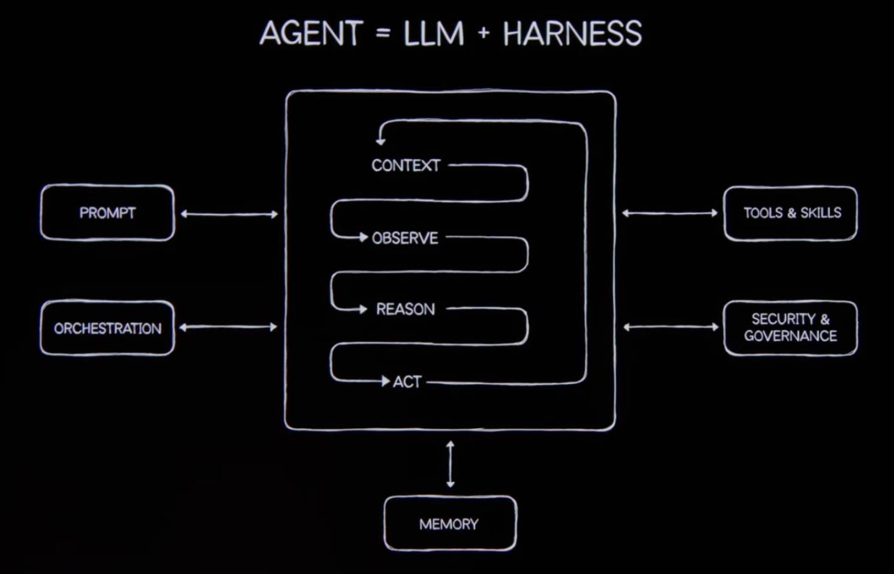

# orchestrator-harness-skills

A Claude skill that turns an agent into a **strict orchestrator** built on the `AGENT = LLM + HARNESS` model.

---



---

## What it does

When this skill is active, the agent stops acting as a generalist and starts acting as a disciplined orchestrator:

- **Restates the goal** so every pass is anchored to a clear success test.
- **Decomposes** the work into the smallest set of independent subtasks.
- **Delegates in parallel** — independent work fans out in a single message so subagents run concurrently.
- **Gates risky or irreversible actions** before they execute.
- **Verifies claims against the source** before declaring done.
- **Returns one coherent answer** — however many agents ran, the user gets a single voice.

Use it whenever a goal is broad, multi-faceted, or spans many files or domains and needs to be broken down and coordinated rather than tackled in one shot.

---

## The harness model

An agent is not just a model. It is a model (the **LLM**) wrapped in a **harness** — the surrounding machinery that feeds the model context, lets it observe, reason, and act, and governs what it is allowed to do. The LLM supplies intelligence; the harness supplies structure, capability, memory, and safety.

### The core loop

```
CONTEXT  ->  OBSERVE  ->  REASON  ->  ACT  ->  (back to CONTEXT)
```

| Phase | What happens |
|-------|-------------|
| CONTEXT | Assemble what the agent needs to know for this pass; read prior state from memory. |
| OBSERVE | Take stock of current state, inputs, and incoming results; do cheap orientation. |
| REASON | Decompose into independent subtasks; plan parallel vs. barrier; run the pre-ACT security gate. |
| ACT | Spawn specialist subagents concurrently; invoke tools; persist intermediate results to memory. |

### The five pillars (around the loop)

| Pillar | Role |
|--------|------|
| **PROMPT** | The framed goal that drives the loop. |
| **ORCHESTRATION** | Decompose, delegate, fan out in parallel. |
| **TOOLS & SKILLS** | Capabilities the agent invokes during ACT. |
| **SECURITY & GOVERNANCE** | Guardrails and least privilege; gates ACT before state changes. |
| **MEMORY** | Persistent state — read at loop entry, written at loop exit. |

---

## Installation

### Option 1 — npx (quickest)

Requires Node.js >= 16.7.

There are two npx forms depending on where the package lives at the time you run it.

**From GitHub (no npm account needed — works once the repo has been pushed):**

```
npx github:nodoby1x/orchestrator-harness-skills
```

**From the npm registry (works only after the maintainer has run `npm publish`, and only if the name `orchestrator-harness-skills` is available on the registry — otherwise it must be scoped, e.g. `@username/orchestrator-harness-skills`):**

```
npx orchestrator-harness-skills
```

Neither form will work until the corresponding prerequisite is met (repo pushed / package published).

**What the installer does:**

- By default it installs the skill into `~/.claude/skills/orchestrator-harness-skills`, making it available across all your Claude Code projects.
- Add `--project` (or `-p`) to install into the current project's `./.claude/skills/` instead:

  ```
  npx orchestrator-harness-skills --project
  ```

After the install completes, start a new Claude Code session and ask the agent to "orchestrate" or "act as orchestrator" to trigger the skill.

---

### Option 2 — Plugin (one command)

```
/plugin marketplace add nodoby1x/orchestrator-harness-skills
/plugin install orchestrator-harness-skills@harness-skills
```

---

### Option 3 — Manual

Clone the repo and copy the skill folder into Claude's skills directory.

```bash
git clone https://github.com/nodoby1x/orchestrator-harness-skills.git
cp -r orchestrator-harness-skills/skills/orchestrator-harness-skills ~/.claude/skills/
```

On Windows (PowerShell):

```powershell
git clone https://github.com/nodoby1x/orchestrator-harness-skills.git
Copy-Item -Recurse orchestrator-harness-skills\skills\orchestrator-harness-skills $env:USERPROFILE\.claude\skills\
```

After copying, the skill is available to any Claude session pointed at that skills directory.

---

## Usage

Trigger the skill with natural-language requests that match its purpose. Recognized triggers include:

- `orchestrate`, `coordinate`, `run the harness`
- `act as orchestrator`
- `break this down and delegate`
- `run a team on this`
- Large audit, migration, research sweep, or multi-domain task descriptions

**Example prompt:**

```
Orchestrate a full audit of this codebase: check for security issues, outdated
dependencies, and test coverage gaps. Break it down and delegate in parallel.
```

The agent will enter the `CONTEXT -> OBSERVE -> REASON -> ACT` loop, decompose the audit into independent subtasks, delegate them concurrently, gate any risky actions, and return one synthesized report with an honest accounting of any gaps.

---

## What's inside

```
orchestrator-harness-skills/
├── .claude-plugin/
│   ├── marketplace.json          # Marketplace manifest (name: harness-skills)
│   └── plugin.json               # Plugin manifest (name: orchestrator-harness-skills)
├── assets/
│   └── harness-skills.jpg        # AGENT = LLM + HARNESS diagram
├── bin/
│   └── cli.js                    # npx installer (--project / -p flag)
├── skills/
│   └── orchestrator-harness-skills/
│       ├── SKILL.md              # The skill — loop phases, checklist, principles
│       └── references/
│           ├── harness-pillars.md   # Depth on each of the five pillars
│           ├── loop-playbook.md     # Phase-by-phase runbook with worked examples
│           └── governance.md        # Pre-ACT security gate procedure
├── LICENSE                       # MIT
├── package.json                  # npm package manifest (name: orchestrator-harness-skills)
└── README.md
```

---

## License

MIT — see [LICENSE](LICENSE).

---

## Disclaimer

This skill is provided as-is for orchestration workflows. It encodes a procedural operating model; actual agent behavior depends on the Claude model, available tools, and the context of each session. Test the skill in a safe environment before relying on it for consequential or irreversible tasks.
